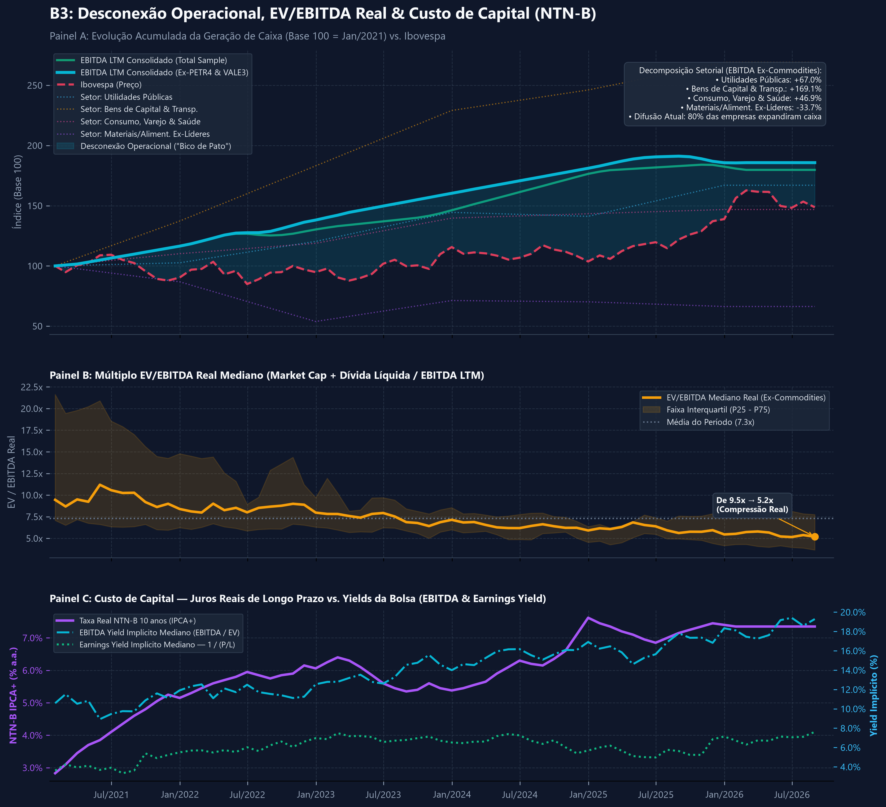

# 📈 Bico de Pato — Dashboard de Valuation e Desconexão Operacional B3

Script em Python que analisa a tese de **Compressão de Múltiplos e Desconexão Operacional** (o famoso “Efeito Bico de Pato”) nas empresas listadas na B3.



---

## O que o dashboard mostra

O gráfico tem três painéis empilhados, todos no mesmo eixo de tempo (de janeiro/2021 até a data mais recente).

### Painel A — Desconexão Operacional vs. Ibovespa

- **Verde**: EBITDA LTM consolidado das 20 empresas (incluindo Petrobras e Vale).
- **Ciano**: mesma coisa, mas sem Petrobras e Vale. Essa é a curva principal da tese.
- **Vermelho tracejado**: Ibovespa (preço).
- A área sombreada entre a curva ciano e o Ibovespa é o “bico do pato” — quando o operacional sobe e o preço não acompanha.
- Linhas pontilhadas mais finas mostram a decomposição setorial do EBITDA Ex-Commodities (Utilidades, Bens de Capital/Transporte, Consumo/Varejo/Saúde e Materiais/Alimentos).
- No canto tem um card com a variação percentual de cada setor e a métrica de difusão.

### Painel B — EV/EBITDA Real (Mediano, Ex-Commodities)

- Linha âmbar: EV/EBITDA mediano real (Market Cap + Dívida Líquida / EBITDA LTM), só das empresas sem Petrobras e Vale.
- Faixa sombreada: intervalo interquartil (P25–P75).
- Linha cinza pontilhada: média do período.
- A anotação no final mostra a compressão do múltiplo do início ao fim da série.

### Painel C — Custo de Capital

- Linha roxa: taxa real da NTN-B 10 anos (IPCA+).
- Linha ciano: EBITDA Yield implícito (EBITDA / EV).
- Linha verde pontilhada: Earnings Yield implícito (1 / P/L).

Esse painel coloca lado a lado o custo de oportunidade da renda fixa real e o yield que a bolsa está oferecendo.

---

## A tese em poucas palavras

O “Bico de Pato” acontece quando:

1. O EBITDA das empresas (especialmente as não ligadas a commodities) continua subindo ou se mantém resiliente.
2. O preço das ações (Ibovespa) não acompanha — geralmente por causa de juros reais altos e risco fiscal.

Essa divergência abre espaço para múltiplos comprimidos e yields mais atrativos em relação à taxa real livre de risco.

**Importante:** os múltiplos, yields e a difusão são calculados **somente com as 18 empresas ex-commodities**. Petrobras e Vale entram só na curva verde do Painel A, porque o EBITDA delas depende muito mais do preço internacional das commodities do que do ciclo doméstico.

### Difusão da Tese

É o percentual das 18 empresas ex-commodities cujo EBITDA atual está acima do valor de janeiro/2021. Serve para mostrar se o crescimento operacional é amplo ou se está concentrado em poucas empresas.

---

## Universo da amostra (20 empresas)

- **Commodities (excluídas dos múltiplos):** PETR4, VALE3  
- **Utilidades Públicas:** ELET3, EQTL3, CPLE6, SBSP3, EGIE3  
- **Consumo, Varejo & Saúde:** ABEV3, MGLU3, LREN3, RADL3, HAPV3  
- **Bens de Capital & Transporte:** WEGE3, RENT3, RAIL3, EMBR3  
- **Materiais/Alimentos Ex-Líderes:** GGBR4, CSNA3, SUZB3, JBSS3  

---

## Sobre os dados fundamentalistas

EBITDA, Dívida Líquida, Lucro Líquido e a série da NTN-B estão **hardcoded** no código.  

Não é preguiça. Os endpoints completos de fundamentos históricos na BRAPI e no yfinance exigem plano pago, e eu não tenho acesso a eles no momento. Os valores foram coletados manualmente (principalmente de AUVP Analítica e ZoneBourse) e checados com os demonstrativos das próprias empresas.

Consequências práticas:

- Para atualizar o dashboard depois de novos balanços, é preciso adicionar os novos pontos na mão.
- Os preços e o número de ações são buscados dinamicamente via yfinance a cada execução. Depois do último ponto hardcoded, o script propaga o último valor conhecido de EBITDA/Dívida enquanto o preço continua se movendo.
- Existe um fallback interno para o número de ações caso a busca dinâmica falhe.

Se você tiver acesso a planos pagos dessas APIs, a recomendação é trocar os dicionários hardcoded por chamadas dinâmicas e deixar o hardcoded só como contingência.

---

## Como rodar

```bash
pip install pandas yfinance matplotlib
python script.py
```

O script baixa as cotações, combina com os dados fundamentalistas, calcula tudo e salva a imagem bico_de_pato_top20_b3.png na raiz do projeto.

---

## Estrutura do repositório
.
├── script.py
├── bico_de_pato_top20_b3.png
└── README.md

---

## Licença

Projeto aberto para fins educacionais e de estudo sobre análise quantitativa e fundamentalista da B3.

---

## 🤖 Quer entender melhor este repositório?

Clique em uma das IAs abaixo. Ela já abre com um prompt pronto pedindo para ler o README e o código. Depois é só perguntar o que quiser.

<p align="center">
  <a href="https://claude.ai/new?q=Quero%20entender%20este%20reposit%C3%B3rio%20sobre%20a%20tese%20Bico%20de%20Pato%20na%20B3.%20Por%20favor%2C%20leia%20primeiro%20o%20README%20e%20o%20script%20principal%20nestes%20links%3A%0A%0Ahttps%3A%2F%2Fraw.githubusercontent.com%2FGabrzz%2Fbico-de-pato%2Fmain%2FREADME.md%0Ahttps%3A%2F%2Fraw.githubusercontent.com%2FGabrzz%2Fbico-de-pato%2Fmain%2Fscript.py%0A%0ADepois%20de%20ler%2C%20fique%20pronto%20para%20responder%20minhas%20perguntas." target="_blank">
    
  </a>
  &nbsp;
  <a href="https://chatgpt.com/?q=Quero%20entender%20este%20reposit%C3%B3rio%20sobre%20a%20tese%20Bico%20de%20Pato%20na%20B3.%20Por%20favor%2C%20leia%20primeiro%20o%20README%20e%20o%20script%20principal%20nestes%20links%3A%0A%0Ahttps%3A%2F%2Fraw.githubusercontent.com%2FGabrzz%2Fbico-de-pato%2Fmain%2FREADME.md%0Ahttps%3A%2F%2Fraw.githubusercontent.com%2FGabrzz%2Fbico-de-pato%2Fmain%2Fscript.py%0A%0ADepois%20de%20ler%2C%20fique%20pronto%20para%20responder%20minhas%20perguntas." target="_blank">
    
  </a>
  &nbsp;
  <a href="https://gemini.google.com/app?q=Quero%20entender%20este%20reposit%C3%B3rio%20sobre%20a%20tese%20Bico%20de%20Pato%20na%20B3.%20Por%20favor%2C%20leia%20primeiro%20o%20README%20e%20o%20script%20principal%20nestes%20links%3A%0A%0Ahttps%3A%2F%2Fraw.githubusercontent.com%2FGabrzz%2Fbico-de-pato%2Fmain%2FREADME.md%0Ahttps%3A%2F%2Fraw.githubusercontent.com%2FGabrzz%2Fbico-de-pato%2Fmain%2Fscript.py%0A%0ADepois%20de%20ler%2C%20fique%20pronto%20para%20responder%20minhas%20perguntas." target="_blank">
    
  </a>
</p>

<p align="center">
  <a href="https://chat.deepseek.com/?q=Quero%20entender%20este%20reposit%C3%B3rio%20sobre%20a%20tese%20Bico%20de%20Pato%20na%20B3.%20Por%20favor%2C%20leia%20primeiro%20o%20README%20e%20o%20script%20principal%20nestes%20links%3A%0A%0Ahttps%3A%2F%2Fraw.githubusercontent.com%2FGabrzz%2Fbico-de-pato%2Fmain%2FREADME.md%0Ahttps%3A%2F%2Fraw.githubusercontent.com%2FGabrzz%2Fbico-de-pato%2Fmain%2Fscript.py%0A%0ADepois%20de%20ler%2C%20fique%20pronto%20para%20responder%20minhas%20perguntas." target="_blank">
    
  </a>
  &nbsp;
  <a href="https://kimi.moonshot.cn/?q=Quero%20entender%20este%20reposit%C3%B3rio%20sobre%20a%20tese%20Bico%20de%20Pato%20na%20B3.%20Por%20favor%2C%20leia%20primeiro%20o%20README%20e%20o%20script%20principal%20nestes%20links%3A%0A%0Ahttps%3A%2F%2Fraw.githubusercontent.com%2FGabrzz%2Fbico-de-pato%2Fmain%2FREADME.md%0Ahttps%3A%2F%2Fraw.githubusercontent.com%2FGabrzz%2Fbico-de-pato%2Fmain%2Fscript.py%0A%0ADepois%20de%20ler%2C%20fique%20pronto%20para%20responder%20minhas%20perguntas." target="_blank">
    
  </a>
</p>